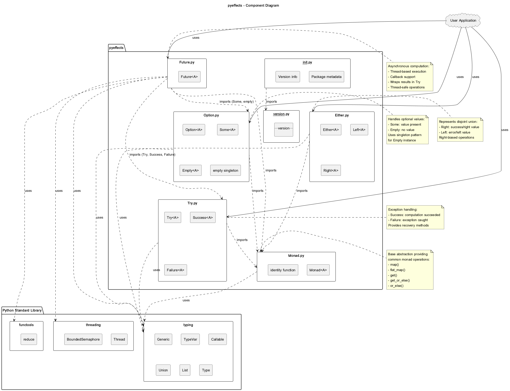
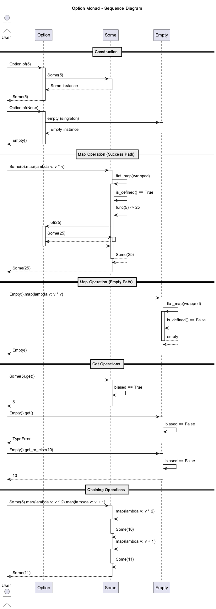
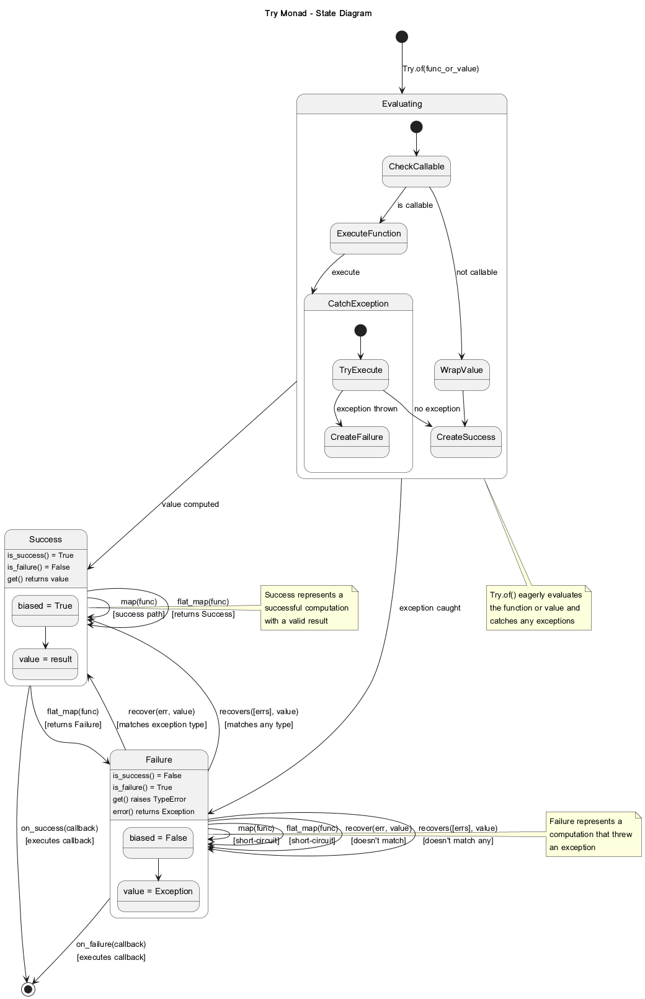
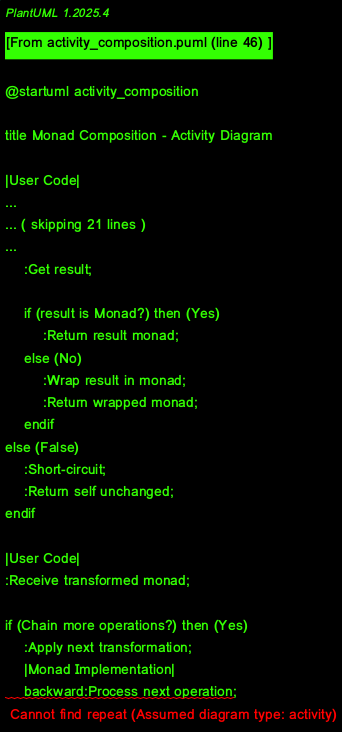

# Comprehensive Documentation for the pyeffects Python Package

**Author:** Manus AI  
**Date:** October 23, 2025

## 1. Introduction

The `pyeffects` package is a Python library designed to bring functional programming concepts for managing side-effects to Python developers. It implements several monadic types that allow for explicit and robust handling of optional values, exceptions, asynchronous computations, and values with multiple possibilities. This approach helps in writing more predictable, composable, and maintainable code by isolating side-effects from pure business logic.

This document provides a comprehensive overview of the `pyeffects` package, its architecture, design patterns, and a comparison with the `Effect-TS` model that inspired it. It includes detailed explanations of each monadic type and UML diagrams to visualize the package's structure and behavior.

### 1.1. What are Monads?

In functional programming, a monad is a design pattern that allows for structuring computations in terms of sequences of operations. A monad can be thought of as a container that wraps a value and provides methods to chain operations on that value. The key benefit of monads is their ability to handle side-effects (like I/O, exceptions, or state changes) in a controlled and composable manner.

The `pyeffects` package implements the following monadic types:

- **Option**: Represents optional values that can be either `Some(value)` or `Empty`.
- **Either**: Represents a value that can be one of two types, typically a `Right` (success) or a `Left` (error).
- **Try**: Encapsulates a computation that can result in either a `Success(value)` or a `Failure(exception)`.
- **Future**: Represents a value that will be available in the future, typically the result of an asynchronous computation.

## 2. Package Architecture and Design

The `pyeffects` package is built around a central `Monad` base class, from which all other monadic types inherit. This provides a consistent interface for all the effect types in the library.

### 2.1. Class Diagram

The following class diagram illustrates the main classes in the `pyeffects` package and their relationships:


### 2.2. Component Diagram

The component diagram below shows the internal modules of the `pyeffects` package and their dependencies on the Python standard library:



### 2.3. Core Design Patterns

The package leverages several key design patterns:

- **Template Method Pattern**: The `Monad` base class defines the structure of monadic operations, with subclasses providing concrete implementations.
- **Factory Method Pattern**: Each monad type has a static `of()` method for creating new instances.
- **Strategy Pattern**: A `biased` flag is used to differentiate between success and failure cases, allowing for polymorphic behavior.
- **Observer Pattern**: The `Future` monad uses an observer pattern to notify subscribers when an asynchronous computation completes.
- **Singleton Pattern**: The `Empty` class uses a singleton pattern to ensure there is only one instance of `Empty`.

## 3. The `Monad` Base Class

The `Monad` class is the foundation of the `pyeffects` package. It defines the common interface for all monadic types, including the `map` and `flat_map` methods that are essential for chaining operations.

Key methods of the `Monad` class:

- `of(x)`: A static method to create a new monad instance.
- `map(func)`: Applies a function to the wrapped value and returns a new monad.
- `flat_map(func)`: Applies a function that returns a monad to the wrapped value, effectively chaining monadic operations.
- `get()`: Unsafely retrieves the wrapped value.
- `get_or_else(default)`: Safely retrieves the wrapped value or a default if the monad is in a failure state.

## 4. The `Option` Monad

The `Option` monad is used to represent optional values. It can be either a `Some` containing a value or an `Empty` representing the absence of a value. This is a powerful alternative to using `None` and helps to avoid `NullPointerExceptions`.

### 4.1. `Option` Sequence Diagram

The following sequence diagram shows the flow of operations for the `Option` monad:



### 4.2. `Option` Usage

```python
from pyeffects.Option import Option, Some, Empty

def divide(a, b):
    if b == 0:
        return Empty()
    else:
        return Some(a / b)

result1 = divide(10, 2).map(lambda x: x * 3)  # Some(15.0)
result2 = divide(10, 0).map(lambda x: x * 3)  # Empty()

print(result1.get_or_else(0))  # 15.0
print(result2.get_or_else(0))  # 0
```

## 5. The `Either` Monad

The `Either` monad represents a value that can be one of two types, conventionally a `Right` for a success value and a `Left` for an error value. It is particularly useful for functions that can fail in a way that you want to handle explicitly.

### 5.1. `Either` Usage

```python
from pyeffects.Either import Either, Left, Right

def parse_int(s):
    try:
        return Right(int(s))
    except ValueError as e:
        return Left(str(e))

result1 = parse_int("123").map(lambda x: x + 7)  # Right(130)
result2 = parse_int("abc").map(lambda x: x + 7)  # Left("invalid literal for int() with base 10: 'abc'")

if result1.is_right():
    print(f"Success: {result1.right()}")

if result2.is_left():
    print(f"Error: {result2.left()}")
```

## 6. The `Try` Monad

The `Try` monad encapsulates a computation that might throw an exception. It can be either a `Success` containing the result of the computation or a `Failure` containing the exception that was thrown.

### 6.1. `Try` State Diagram

The state diagram below illustrates the lifecycle of a `Try` monad:



### 6.2. `Try` Usage

```python
from pyeffects.Try import Try

def risky_operation():
    # This might throw an exception
    return 10 / 0

result = Try.of(risky_operation)

result.on_success(lambda x: print(f"Result: {x}"))
result.on_failure(lambda e: print(f"Error: {e}"))

recovered_result = result.recover(ZeroDivisionError, 0) # Success(0)
```

## 7. The `Future` Monad

The `Future` monad represents a value that will be available at some point in the future. It is used for asynchronous computations and is implemented using Python's `threading` module.

### 7.1. `Future` Sequence Diagram

This sequence diagram shows the asynchronous flow of a `Future` computation:


### 7.2. `Future` Usage

```python
import time
from pyeffects.Future import Future

def long_running_task():
    time.sleep(2)
    return "Task complete!"

future = Future.run(long_running_task)

future.on_complete(lambda result: print(result.get()))

print("Waiting for the future to complete...")
# The program continues to execute while the future is running
```

## 8. Monad Composition

The real power of monads comes from their ability to be composed. The `map` and `flat_map` methods allow you to chain operations together in a clean and readable way, without having to write boilerplate code for handling different states (like `Some`/`Empty` or `Success`/`Failure`).

### 8.1. Composition Activity Diagram

The following activity diagram illustrates the general process of monad composition:



## 9. Comparison with Effect-TS

While `pyeffects` is inspired by the `Effect-TS` ecosystem, it is not a direct port. `Effect-TS` is a much more comprehensive library for TypeScript that provides a rich set of tools for building robust applications. The table below highlights some of the key differences:

| Feature | `pyeffects` | `Effect-TS` |
|---|---|---|
| **Core Abstraction** | `Monad` | `Effect` |
| **Error Handling** | `Try` monad | Typed error channels in `Effect[R, E, A]` |
| **Asynchronicity** | `Future` with threads | `Fiber`-based concurrency |
| **Resource Management** | Manual | `Scope`-based resource management |
| **Dependency Injection** | Manual | `Layer`-based dependency injection |
| **Observability** | None | Built-in tracing and metrics |

## 10. Conclusion

The `pyeffects` package provides a solid foundation for developers looking to incorporate functional programming patterns for side-effect management in their Python projects. By using the `Option`, `Either`, `Try`, and `Future` monads, you can write more explicit, robust, and composable code. While it may not be as feature-rich as `Effect-TS`, `pyeffects` offers a pragmatic and accessible entry point into the world of functional effects in Python.

## 11. References

- **pyeffects on PyPI:** [https://pypi.org/project/pyeffects/](https://pypi.org/project/pyeffects/)
- **pyeffects on GitHub:** [https://github.com/vickumar1981/pyeffects](https://github.com/vickumar1981/pyeffects)
- **pyeffects Documentation:** [https://pyeffects.readthedocs.io/](https://pyeffects.readthedocs.io/)
- **Effect-TS Website:** [https://effect.website/](https://effect.website/)
- **UML Standard:** [https://www.uml.org/](https://www.uml.org/)

